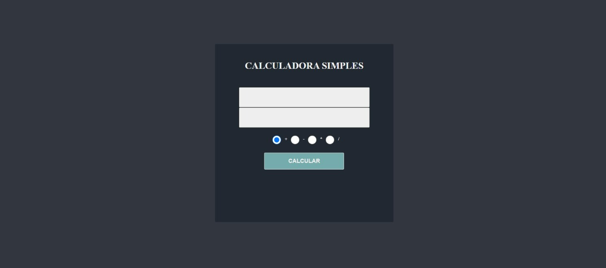
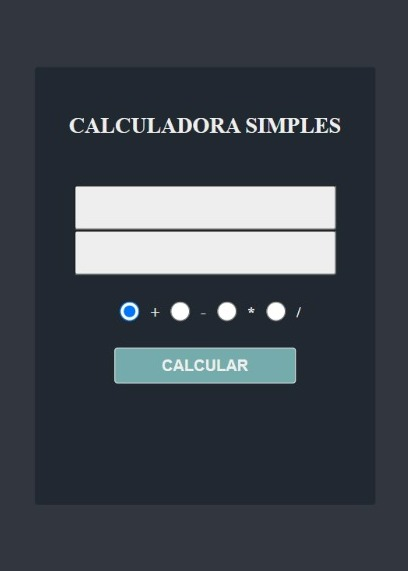

# 📋 Indíce

- [Bem-vindo](#id01)
- [Proposta](#id02)
- [Desafio](#id03)
- [Aprendizado](#id04)
- [Prosseguimento](id05)
- [Screenshots](#id06)
- [Links](#id07)
- [Tecnologias utilizadas](#id08)
- [Pré-requisitos](#id09)
- [Procedimentos de instalação](#id010)
- [Informações](#id011)

# Bem-vindo! 👋 <a name="id01"></a>

**Calculadora Simples**
<br />

## 🚀 Proposta <a name="id02"></a>

Aplicação de uma calculadora utilizando HTML, CSS e JavaScript.
<br />

## :trophy: Desafio <a name="#id03"></a>

- Entrada de Dados: O usuário insere dois números nos campos de entrada. Seleciona a operação desejada (adição, subtração, multiplicação ou divisão) através dos botões de rádio.

- Cálculo:
  Com base na operação selecionada, realiza a operação matemática apropriada entre os dois números.

- Exibição do Resultado: Mostra o resultado da operação no elemento HTML designado para exibir o resultado.

- Interação do Usuário: A calculadora deve ser responsiva às interações do usuário, como clicar no botão de calcular ou mudar a operação selecionada.

- Estilo Visual: Garantir que a interface da calculadora seja esteticamente agradável e fácil de usar, com elementos bem organizados e legíveis.

## :trophy: Aprendizado <a name="#id04"></a>

#### Construído com:

- Integração HTML, CSS e JavaScript: Aprendizado sobre como essas tecnologias se integram para criar uma aplicação web funcional.

- Manipulação do DOM: Como manipular o Document Object Model (DOM) para interagir dinamicamente com os elementos HTML.

- Tratamento de Eventos: Como lidar com eventos de usuário, como cliques em botões.

- Lógica de Programação: Implementação de uma lógica simples de cálculo baseada em condições e operações aritméticas.

## :trophy: Prosseguimento <a name="id05"></a>

- Realizar outros projetos utilizando o React.js

<br />

# :camera_flash: Screenshots <a name="id06"></a>

## :video_camera: Video

https://github.com/RaizaCirne/calculadora-simples/assets/109912543/41db9dd5-90d4-4d8e-9e9c-b221652c08af

## :desktop_computer: Desktop design



## :iphone: Mobile design



<br />

# :heavy_check_mark: Links <a name="id07"></a>

<br />

- Para acessar o site [Clique aqui](#)

<br />

# 🛠 Tecnologias utilizadas <a name="id08"></a>

<br />

- JavaScript
- Git
- SASS
- CSS3
- HTML5

<br />

# ☑️ Pré-requisitos <a name="id09"></a>

<br />

- [x] Editor de código de sua preferência (recomendado VS code)
- [x] Git

<br />

# 📝 Procedimentos de instalação <a name="id010"></a>

<br />

Clone este repositório usando o comando:

```bash
git clone https://github.com/RaizaCirne/calculadora-simples.git
```

Baixar arquivo zip

Extrir arquivos

Abrir pasta no editor de código.

<br />

# :sunglasses: Informações <a name="id011"></a>

<br />

- Personal Page - [Raíza Cirne Braz](#)
- Frontend Mentor - [@RaizaCirne](https://www.frontendmentor.io/profile/RaizaCirne)
- GitHub - [RaizaCirne](https://github.com/RaizaCirne)
- LinkedIn - [Raíza Cirne Braz](https://www.linkedin.com/in/ra%C3%ADzacirne/)

**JavaScript - GIT - SASS - CSS3 - HTML5** 🚀
